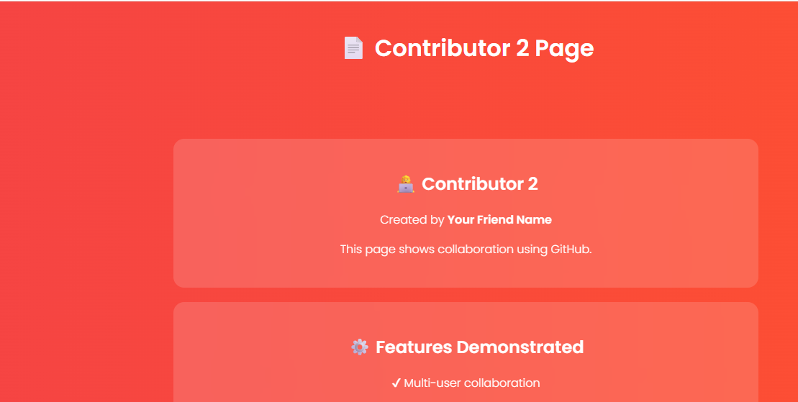

## 📸 Project Screenshots

### 👩‍💻 Contributor 1 Page


---

### 👨‍💻 Contributor 2 Page


---

[](https://pavithraB-wec.github.io/html-demo-project)
[](https://github.com/pavithraB-wec/html-demo-project/graphs/contributors)
[](https://github.com/pavithraB-wec/html-demo-project)
[](https://code.visualstudio.com)
[](https://git-scm.com)
[](https://github.com/pavithraB-wec/html-demo-project/stargazers)


---

## 📌 About This Project

> **"Learn GitHub Today, Build Your Future Tomorrow!"**

This project demonstrates how **two contributors** can collaborate on the same GitHub repository using **VS Code** and **Git**, then deploy the final project live using **GitHub Pages** — completely free.

It was created as part of a **seminar demonstration** to help junior students understand real-world GitHub collaboration workflows from scratch.

---

## ✨ What This Project Covers

| # | Topic | Description |
|---|-------|-------------|
| 1 | 🔧 Git Setup | Initialize a repo and connect it to GitHub |
| 2 | 📤 Push & Pull | Upload and sync code between contributors |
| 3 | 🤝 Collaborators | Add a second contributor with write access |
| 4 | 🌿 Multi-Contributor | Two people uploading different files to one repo |
| 5 | 📄 README | Write professional project documentation |
| 6 | 🌐 Deployment | Host the project live using GitHub Pages |

---

## 🌐 Live Demo


### 🔗 [https://pavithraB-wec.github.io/html-demo-project](https://pavithraB-wec.github.io/html-demo-project)

*Deployed via GitHub Pages — updates automatically on every push to `main`*


---

## 📂 Project Structure
```
html-demo-project/
│
├── 📄  index.html       ← Home page  (by Contributor 1 — Pavi)
├── 📄  about.html       ← About page (by Contributor 2 — Ranjana Devi)
└── 📝  README.md        ← Project documentation
```

---

## 👩‍💻 Contributors


 **B. Pavithra** 
   . Contributor 1 
  . Uploaded `index.html` 
 [](https://github.com/pavithraB-wec)
 
 **K. Ranjana Devi** 
 .  Contributor 2  
 . Uploaded `about.html`
 [](https://github.com/ranjanadevi1802) 


---

## 🛠️ Tools & Technologies


---

## 🚀 Complete Step-by-Step Procedure

👤 PART 1 — Contributor 1: Create & Push (Pavi)


**Step 1 — Create Repository on GitHub**
```
1. Go to github.com → Click ➕ → New Repository
2. Name:        html-demo-project
3. Visibility:  Public
4. ⚠️ Do NOT check "Add a README file"
5. Click: Create Repository
```

**Step 2 — Create Project Folder Locally**
```
Create folder:  html-demo-project/
Add file:       index.html  (with your HTML content)
```

**Step 3 — Open in VS Code**
```
File → Open Folder → Select html-demo-project
```

**Step 4 — Initialize Git & Push**
```bash
git init
git add .
git commit -m "Initial commit: add index.html"
git remote add origin https://github.com/pavithraB-wec/html-demo-project.git
git branch -M main
git push -u origin main
```

**Step 5 — Verify Upload**
```
Refresh GitHub → index.html should now be visible ✅
```

🤝 PART 2 — Add Collaborator

**Step 6 — Add Contributor 2 as Collaborator**
```
Repository → ⚙️ Settings → Collaborators → Add people
→ Enter GitHub username: ranjanadevi1802
→ Click: Add to repository
```

**Step 7 — Contributor 2 Accepts Invitation**
```
Check email → Accept the GitHub invitation link
✅ Contributor 2 now has write access
```

👤 PART 3 — Contributor 2: Clone & Push (Ranjana Devi)

**Step 8 — Clone the Repository**
```bash
git clone https://github.com/pavithraB-wec/html-demo-project.git
cd html-demo-project
code .
```

**Step 9 — Create about.html**
```
Create new file: about.html
Add your HTML content to the file
```

**Step 10 — Add, Commit & Push**
```bash
git add .
git commit -m "feat: add about.html by Ranjana Devi"
git pull origin main        # Always pull before pushing!
git push origin main
```

**Step 11 — Verify**
```
Refresh GitHub → both index.html and about.html visible ✅
```

📄 PART 4 — Add README.md

**Step 12 — Create README.md**
```
Create new file: README.md
Add project documentation (title, description, contributors, steps)
```

**Step 13 — Commit & Push README**
```bash
git add README.md
git commit -m "docs: add project README"
git push
```

🌐 PART 5 — Deploy with GitHub Pages

**Step 14 — Enable GitHub Pages**
```
Repository → ⚙️ Settings → Pages

Source:  Deploy from a branch
Branch:  main
Folder:  / (root)

→ Click Save
```

**Step 15 — Access Your Live Website**
```
Wait 1–2 minutes, then visit:
https://pavithraB-wec.github.io/html-demo-project
```
```
🎉 Your website is now live on the internet — for FREE!
```


---

## 📋 Git Commands Quick Reference

| Command | What It Does |
|---------|--------------|
| `git init` | Initialize a new Git repository |
| `git add .` | Stage all changed files |
| `git commit -m "message"` | Save a snapshot with a label |
| `git remote add origin <url>` | Connect local repo to GitHub |
| `git push -u origin main` | Upload commits to GitHub |
| `git clone <url>` | Copy a GitHub repo to your computer |
| `git pull origin main` | Download latest changes from GitHub |
| `git status` | Check what has changed |
| `git log --oneline` | View compact commit history |

---

## 🌟 Key Learnings

- ✅ Git initialization and configuration
- ✅ Staging, committing, and pushing code
- ✅ Adding collaborators with write access
- ✅ Working with multiple contributors on one repository
- ✅ Avoiding and resolving merge conflicts
- ✅ Writing professional README documentation
- ✅ Hosting a live website using GitHub Pages

---

## 💡 Pro Tips

> **Always `git pull` before `git push`** — prevents merge conflicts when working in a team.

> **Write meaningful commit messages** — `"feat: add navigation bar"` is far better than `"changes"`.

> **Never edit the same file simultaneously** — coordinate with your collaborator to avoid conflicts.

> **Keep your contribution graph active** — even small commits show consistent practice.

> **Add a live URL to your README** — it makes your project look complete and professional.

---

## 🎓 Academic Purpose

This project was developed as part of a **GitHub Collaboration Seminar** at:

> **Women's Engineering College, Puducherry**
> Department of Information Science & Engineering


The goal is to help junior students understand how GitHub enables professional team collaboration, version control, and free web deployment.

---

## ⭐ Support This Project

If this project or the seminar helped you:

- 🌟 **Star** this repository
- 🍴 **Fork** it and try the steps yourself
- 📢 **Share** with your batchmates and juniors

---


**✨ Learn GitHub Today, Build Your Future Tomorrow ✨**

*GitHub HTML Collaboration Project · ISE Seminar · 2026*


